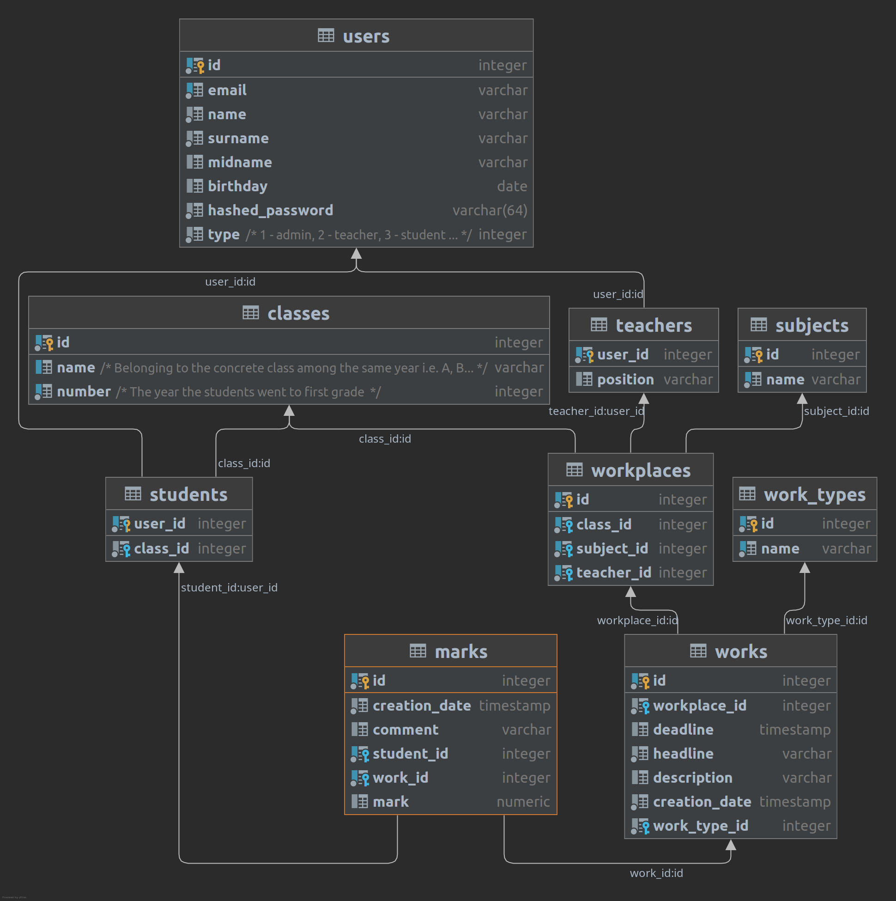

# Online Diary
**Backend •** [](https://gitlab.com/MathApe/online-diary/-/commits/main)

**Frontend •** [](https://app.netlify.com/sites/online-diary-mathape/deploys)

## Description
Online diary for teachers and students to collaborate.
Make and do different types of works, group students by classes etc

> TODO: put FR (and NFR) here if needed, features

## Visuals
Depending on what you are making, it can be a good idea to include screenshots or even a video (you'll frequently see GIFs rather than actual videos). Tools like ttygif can help, but check out Asciinema for a more sophisticated method.

### Database structure


### [API structure](https://online-diary-mathape.herokuapp.com/api/v1/docs) in [OpenAPI Specification](https://swagger.io/specification/)


## Installation
### To launch this service local you need to
#### 1. Clone the repository
```bash
git clone git@gitlab.com:MathApe/online-diary.git
cd online-diary
```
#### 2. Install docker and docker compose for your system
https://docs.docker.com/engine/install/

https://docs.docker.com/compose/install/

#### 3. Build and run all services

```bash
docker-compose -f docker-compose-local.yaml up --build --detach
```

> **If this is your first time, please run database migrations**
> ```bash
> docker-compose -f docker-compose-local.yaml exec backend alembic upgrade head
> ```
> And rerun docker-compose
> ```bash
> docker-compose -f docker-compose-local.yaml up --build
> ```

## Develop

### To rebuild only 1 service you need to
```bash
docker-compose -f docker-compose-local.yaml up --detach --build {service-name}
```

### To run tests execute
```bash
docker-compose -f docker-compose-local.yaml exec backend pytest
```

### To run DB migration
```bash
docker-compose -f docker-compose-local.yaml exec backend alembic upgrade head
```
### To run migration after structure change
```bash
docker-compose -f docker-compose-local.yaml exec backend alembic revision --autogenerate -m "Add a column" 
```
Change owner of the files if it is needed
```bash
docker-compose -f docker-compose-local.yaml exec backend chown -R 1000:1000 migrations
```
Edit the file ```online-diary/services/backend/migrations/versions/b54somehash14_add_a_column.py```
or just a new file with corresponding name to correct the migration

Run again migration to head
```bash
docker-compose -f docker-compose-local.yaml exec backend alembic upgrade head
```
> **WARNING**: If you add a new model, put its metatada into `target_metadata` in file `services/backend/migrations/env.py`


## Usage
Use examples liberally, and show the expected output if you can. It's helpful to have inline the smallest example of usage that you can demonstrate, while providing links to more sophisticated examples if they are too long to reasonably include in the README.

## Contributing
If you find this repository useful and want to improve it - just fork it.

## Authors and acknowledgment
Authors: Dmytro Bubela, Nazar Havryliuk, Oliinyk Maiia, Nadiia Tolstukha

## License
This project is licensed under the terms of the [MIT license](LICENSE).

## Project status
> **WARNING**: Not ready for production, vulnerable to CSRF attacks

Project was made for University course, probably will have no further updates after the passing

